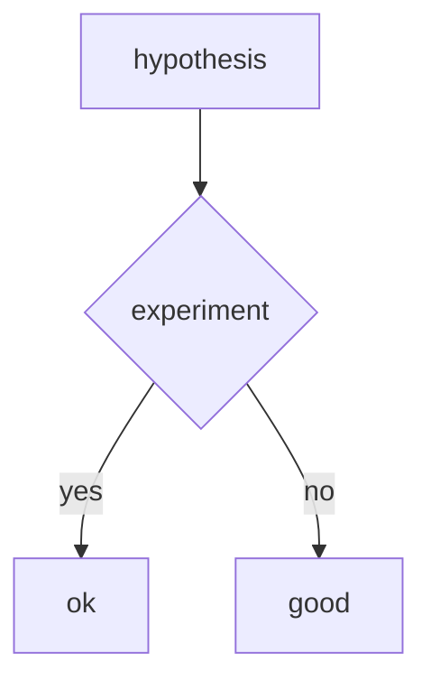

# 과학적 분석 및 발표
----
## 1차 숙제
서울시 기온 평균

최고기온 최저기온

미래예측


```python
  def();
  return
```


```mermaid
  flowchart TD;
     A[hypothesis]-->B{experiment};
     B -- yes --> C[ok];
     B -- no --> D[good];

```
